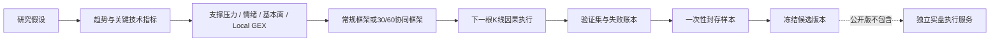

# CTA Strategy Research Showcase

一个面向量化研究岗位的**脱敏、可运行**项目，重点展示我如何把交易思路转成有因果边界、可解释、可验证的程序化策略。

它不是原始研究仓库的完整开源版本，不包含公司代码、真实策略参数、实盘账户、私有数据或可直接交易的 Alpha。仓库中的行情、阈值和收益仅用于确定性演示。

## 项目想解决什么

策略研究的难点不是“算出几个指标”，而是让下面几个问题形成闭环：

- 信号到底使用了当时可见的信息，还是偷看了未来？
- 趋势方向、进场时机、支撑压力和风险因子如何协同，而不是互相覆盖？
- 回测中最好的候选，是否只是某段行情或某组参数的偶然结果？
- 自动研究如何保留实验血统和失败原因，避免反复寻找同一种伪规律？
- 研究代码频繁变化时，怎样避免它直接影响实盘执行？

这个公开版把上述问题压缩成五个可以独立检查的模块。

## 核心能力

### 1. 常规因果回测框架

常规框架用于快速验证不同类型的策略逻辑。每个信号必须声明：

- `signal_bar_idx`：信号在哪根**已完成**K线上形成；
- `exec_bar_idx`：在哪根后续K线上执行；
- `action`：开多、平多、开空或平空；
- `reason`：信号产生原因。

没有指定执行位置时，框架默认下一根K线执行。同K线执行、越界执行和没有对应持仓的平仓都会被拒绝，并保留结构化原因，而不是静默跳过。

### 2. 30/60分钟协同框架

常规框架之外，项目提供一个方向与时机分离的研究样例：

- 60分钟已完成K线负责判断慢周期环境方向；
- 30分钟已完成K线负责识别进入时机；
- 两个周期方向冲突时等待，不用小周期信号强行推翻大周期环境；
- 不完整的60分钟K线不会进入判断。

`build_effective_bars` 可删除实体占整根振幅比例过低的K线，减少低信息实体对连续性判断的干扰，同时保留原始时间索引映射，保证信号仍能回到真实时间轴执行。

### 3. 趋势、支撑压力与 Local GEX 协同

因子组合不是简单投票：

- 趋势因子提供主要方向；
- 支撑压力衡量潜在价格空间；
- 情绪、基本面调整置信度；
- Local GEX只改变既有趋势的延续强度，不单独创造交易方向；
- 极端波动或价格空间不足拥有硬否决权。

演示中，负Local GEX被解释为对既有趋势延续的增强条件，而不是“出现负GEX就必然上涨或下跌”。

### 4. 可审计的自动研究 Loop

公开版实现了研究纪律，不连接任何付费大模型：

```text
研究假设 → 候选血统 → 验证集 → 一次性封存样本 → 晋级或失败账本
```

候选必须先达到验证门槛，才允许打开一次封存样本。未达标候选进入失败账本；“本轮相对最好”不等于自动晋级。这个边界可以接入LLM提出的假设，也可以接入人工策略研究。

### 5. 研究与实盘隔离

本仓库只展示研究端。真实项目中，研究结果需要冻结为明确版本，再交给独立执行服务加载；研究页面、因子Loop和频繁更新的代码不直接连接交易账户。

公开版故意不包含实盘连接、账户配置、订单路由和真实策略版本。

## 研究闭环



## 五分钟运行

要求：Python 3.11 或更高版本。

```bash
python -m venv .venv
```

Windows PowerShell：

```powershell
.\.venv\Scripts\Activate.ps1
python -m pip install -e ".[dev,web]"
pytest -q
cta-showcase
cta-showcase-web
```

Linux/macOS：

```bash
source .venv/bin/activate
python -m pip install -e ".[dev,web]"
pytest -q
cta-showcase
cta-showcase-web
```

然后访问 `http://127.0.0.1:8000`。页面和命令行共享同一个确定性演示结果。

预期测试结果：

```text
19 passed
```

## 目录

```text
src/cta_research_showcase/
├── causal_backtest.py      # 信号合法性、下一根执行、持仓与成本
├── strategy_audit.py       # AST静态审计：未来索引和危险调用
├── multitimeframe.py       # 常规状态、30/60对齐、小实体过滤
├── factor_combination.py   # 趋势与上下文因子协同、风险否决
├── research_loop.py        # 候选血统、验证门槛、封存样本、失败账本
├── demo.py                 # 合成行情端到端演示
└── api.py                  # FastAPI展示接口
frontend/                   # 无构建步骤的展示页面
tests/                      # 核心边界测试
docs/                       # 架构与面试说明
```

## 公开边界

- 只使用代码生成的合成OHLCV；
- 示例阈值不对应任何真实交易品种；
- 示例盈亏是点数级流程验证，不代表历史或实盘收益；
- 不包含原始私有仓库提交历史；
- 不包含任何公司期间形成的源代码和数据；
- 不提供投资建议，也不能直接用于实盘交易。

更完整的设计说明见 [docs/ARCHITECTURE.md](docs/ARCHITECTURE.md)，面试表达见 [docs/INTERVIEW_GUIDE.md](docs/INTERVIEW_GUIDE.md)。

